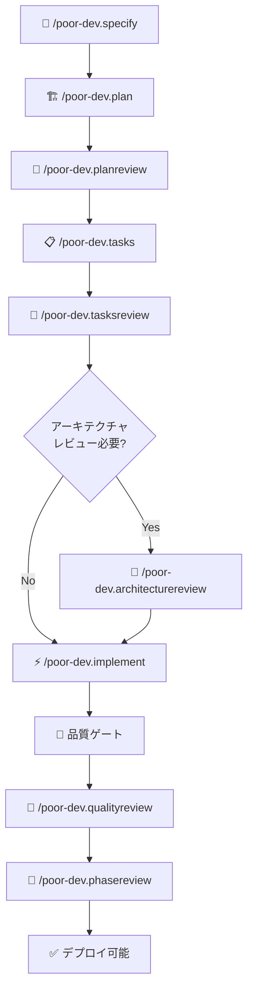
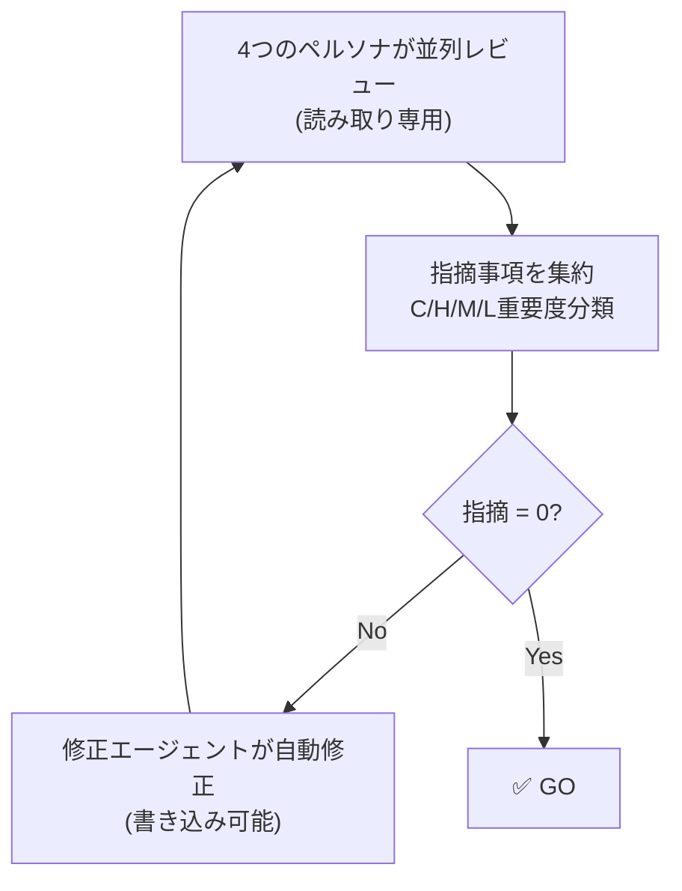

# PoorDevSkills

> **PoorDevSkills** is a structured AI-driven development workflow for solo developers
> using affordable but less reliable models (e.g., GLM4.7).
> It compensates for model quality gaps through multi-persona reviews
> with automatic fix loops, ensuring production-grade output from budget AI.

---

## このプロジェクトについて

### 対象読者

**GLM4.7 など安価だが品質にばらつきがある AI モデル**で開発を進める**個人開発者**のためのツールセットです。

### 解決する問題

安価モデルはハルシネーション・品質低下が起きやすく、1 人では全てをレビューしきれません。

### 解決策

**構造化ワークフロー + 多角的 AI レビュー + 自動修正ループ**で品質を底上げします。

「貧乏開発者（Poor Dev）」のための開発スキルセット ── それが **PoorDevSkills** です。

---

## 開発フロー全体図



---

## レビューシステム

PoorDevSkills の核心は **多角的 AI レビュー**と**自動修正ループ**です。

### 自動修正ループ

各レビューは以下のループで**指摘ゼロになるまで自動修正**します。



### 5 種類のレビューとペルソナ構成

| レビュー | コマンド | ペルソナ | 何を見るか |
|---------|---------|---------|----------|
| 計画 | `/poor-dev.planreview` | PM, リスク, 価値, 批判 | ビジネス価値、リスク、実現可能性 |
| タスク | `/poor-dev.tasksreview` | TechLead, Senior, DevOps, Junior | 依存関係、粒度、実行可能性 |
| 設計 | `/poor-dev.architecturereview` | Architect, Security, Performance, SRE | SOLID 原則、脆弱性、性能 |
| 品質 | `/poor-dev.qualityreview` | QA, TestDesign, Code, Security | テスト網羅性、コード品質 + 敵対的レビュー |
| 完了 | `/poor-dev.phasereview` | QA, Regression, Docs, UX | 完了基準、リグレッション、ドキュメント |

### 安全機構

- **読み取り専用レビュア / 書き込み専用修正者の分離**: レビュアはコードを変更できず、修正者はレビュー判定を変更できない
- **10 回ループ安全弁**: 修正ループが 10 回を超えた場合、自動停止して人間に判断を委ねる
- **3 ストライクルール**: 同一指摘が 3 回修正に失敗した場合、エスカレーションする

---

## クイックスタート

```bash
# 1. 仕様を作成
/poor-dev.specify "ユーザー認証機能を追加する"

# 2. 技術計画を作成
/poor-dev.plan

# 3. 計画をレビュー（自動修正ループ付き）
/poor-dev.planreview

# 4. タスクを分解
/poor-dev.tasks

# 5. タスクをレビュー（自動修正ループ付き）
/poor-dev.tasksreview

# 6. 実装
/poor-dev.implement

# 7. 品質レビュー（品質ゲート + 自動修正ループ付き）
/poor-dev.qualityreview

# 8. フェーズ完了レビュー
/poor-dev.phasereview
```

---

## コマンドリファレンス

### 仕様・計画系

| コマンド | 用途 | 出力 |
|---------|------|------|
| `/poor-dev.specify` | 機能仕様の作成 | spec.md |
| `/poor-dev.clarify` | 仕様の曖昧箇所を質問で解消 | 更新された spec.md |
| `/poor-dev.plan` | 技術計画の作成 | plan.md |
| `/poor-dev.tasks` | タスク分解 | tasks.md |
| `/poor-dev.implement` | タスクに従い実装 | 実装コード |
| `/poor-dev.analyze` | 仕様・計画・タスクの整合性分析 | 分析レポート |
| `/poor-dev.checklist` | ドメイン別チェックリスト生成 | チェックリスト |

### レビュー系

| コマンド | 用途 | ペルソナ数 |
|---------|------|----------|
| `/poor-dev.planreview` | 計画レビュー + 自動修正 | 4 |
| `/poor-dev.tasksreview` | タスクレビュー + 自動修正 | 4 |
| `/poor-dev.architecturereview` | 設計レビュー + 自動修正 | 4 |
| `/poor-dev.qualityreview` | 品質レビュー + 自動修正 | 4 |
| `/poor-dev.phasereview` | フェーズ完了レビュー + 自動修正 | 4 |

### ユーティリティ

| コマンド | 用途 |
|---------|------|
| `/poor-dev.constitution` | プロジェクト憲法の作成・更新 |
| `/poor-dev.taskstoissues` | タスクを GitHub Issues に変換 |

---

## 詳細ドキュメント

| ドキュメント | 内容 |
|-------------|------|
| [AGENT.md](AGENT.md) | 完全なワークフロードキュメント |
| [constitution.md](.poor-dev/memory/constitution.md) | 10 原則の詳細（プロジェクト憲法） |
| [templates/](.poor-dev/templates/) | 仕様・計画・タスクのテンプレート |

---

## ライセンス

MIT License
