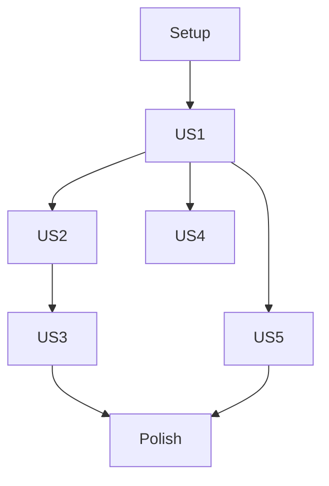

# Implementation Tasks: Function Visualizer with Calculus

**Feature**: 002-function-visualizer
**Branch**: 002-function-visualizer
**Generated**: 2026-02-14

## Implementation Strategy

MVP first: US1 + US2 form the core. US3, US4, US5 are enhancements.

## Dependencies

## Phase 1: Setup

- [X] T001 Create project structure (package.json, src/, tests/)
  - files: package.json, src/js/, src/styles/, src/tests/
- [X] T002 Set up HTML entry point with responsive layout
  - depends: [T001]
  - files: src/index.html, src/styles/main.css
- [X] T003 Configure build tool (esbuild) and dev server
  - depends: [T001]
  - files: package.json

## Phase 2: User Story 1 - 基本関数の可視化 (P1)

**Goal**: Users can input functions and see graphs in real-time.
**Independent Test**: Input "sin(x)" → sine wave displayed

- [X] T004 [US1] Create ExpressionParser module with math.js integration
  - depends: [T001]
  - files: src/js/calculus/ExpressionParser.js
- [X] T005 [US1] Create InputHandler with 300ms debounce
  - depends: [T002]
  - files: src/js/input/InputHandler.js, src/js/utils/debounce.js
- [X] T006 [US1] Create GraphRenderer with function-plot integration (includes FR-005 axis labels and grid lines)
  - depends: [T002, T004]
  - files: src/js/graph/GraphRenderer.js
- [X] T007 [US1] Create ViewportManager for auto-scale
  - depends: [T006]
  - files: src/js/graph/ViewportManager.js
- [X] T008 [US1] Create ErrorHandler for parse errors
  - depends: [T002]
  - files: src/js/ui/ErrorHandler.js
- [X] T009 [US1] Wire up main.js with all components
  - depends: [T004, T005, T006, T007, T008]
  - files: src/js/main.js

## Phase 3: User Story 2 - 導関数の理解 (P1)

**Goal**: Users can view derivatives overlaid on original function.
**Independent Test**: Input "x^3" → derivative graph shows "3x^2"

- [X] T010 [US2] Create DerivativeCalculator using math.derivative()
  - depends: [T004]
  - files: src/js/calculus/DerivativeCalculator.js
- [X] T011 [US2] Add derivative overlay to GraphRenderer
  - depends: [T006, T010]
  - files: src/js/graph/GraphRenderer.js
- [X] T012 [US2] Add derivative toggle control to UI
  - depends: [T002, T011]
  - files: src/index.html, src/styles/main.css

## Phase 4: User Story 4 - クイックアクセス (P2)

**Goal**: Users can quickly insert common functions.
**Independent Test**: Click "sin" button → "sin(x)" appears in input

- [X] T013 [US4] Create PresetButtons component
  - depends: [T002, T005]
  - files: src/js/input/PresetButtons.js, src/index.html

## Phase 5: User Story 3 - 特定点での分析 (P2)

**Goal**: Users can see x, f(x), f'(x) and tangent line at cursor.
**Independent Test**: Move cursor over graph → tooltip shows values

- [X] T014 [US3] Create TooltipManager with cursor tracking
  - depends: [T006, T010]
  - files: src/js/ui/TooltipManager.js
- [X] T015 [US3] Create TangentLine component
  - depends: [T006, T010]
  - files: src/js/calculus/TangentLine.js
- [X] T016 [US3] Add tangent line toggle to UI
  - depends: [T015]
  - files: src/index.html, src/styles/main.css

## Phase 6: User Story 5 - エラーからの回復 (P3)

**Goal**: Invalid input shows clear error, valid input clears error.
**Independent Test**: Type "invalid((" → error shown, fix → error cleared

- [X] T017 [US5] Enhance ErrorHandler with auto-clear on valid input
  - depends: [T008, T005]
  - files: src/js/ui/ErrorHandler.js
- [ ] T018 [US5] Add edge case handling (undefined points, complex results)
  - depends: [T006, T004]
  - files: src/js/graph/GraphRenderer.js, src/js/calculus/ExpressionParser.js

## Phase 7: Polish & Testing

- [X] T019 Add responsive CSS media queries
  - depends: [T002]
  - files: src/styles/main.css
- [ ] T020 Create unit tests for ExpressionParser, DerivativeCalculator, InputHandler
  - depends: [T004, T005, T010]
  - files: src/tests/unit/ExpressionParser.test.js, src/tests/unit/DerivativeCalculator.test.js, src/tests/unit/InputHandler.test.js
- [ ] T021 Create e2e tests with Playwright
  - depends: [T009, T012]
  - files: src/tests/e2e/graph-interaction.spec.js
- [ ] T022 Cross-browser testing (Chrome, Firefox, Safari, Edge)
  - depends: [T021]
  - files: src/tests/e2e/browser-compat.spec.js

## Parallel Execution

| Phase | Parallelizable | Group |
|-------|---------------|-------|
| P1 Setup | T002, T003 | Sequential (T001 blocks both) |
| P2 US1 | T005, T008 | After T002 |
| P4 US4 | T013 | Independent after T002 |
| P5 US3 | T014, T015 | After Phase 3 |
| P6 US5 | T017, T018 | After Phase 5 |
| P7 Polish | T019, T020 | Parallel |

## Summary

- Total tasks: 22
- Completed: 18
- Remaining: 4 (T018, T020, T021, T022)
- MVP tasks: T001-T012 (Setup + US1 + US2) ✓ COMPLETE
- Parallel opportunities: 6 groups
