# Trace: pipeline-runner.sh

> 対象: `lib/pipeline-runner.sh` (1033 行)
> 生成日: 2026-02-19
> 目的: TS 移行前の全パス・全 exit point の可視化

---

## 1. State Machine Diagram

```mermaid
stateDiagram-v2
    [*] --> ParseArgs: 起動

    ParseArgs --> ValidateArgs: 引数パース完了
    ValidateArgs --> EXIT_1_MISSING_ARGS: 必須引数不足 (L64-67)
    ValidateArgs --> ValidateGit: 引数OK

    ValidateGit --> EXIT_1_NO_GIT: .git 不在 (L72-75)
    ValidateGit --> BuildCompletedSet: .git 確認OK

    BuildCompletedSet --> ResolvePipeline: COMPLETED_SET 構築 (CSV + pipeline-state.json)

    ResolvePipeline --> InitState: PIPELINE_STEPS 解決
    InitState --> NextModeCheck: pipeline-state.json 初期化

    NextModeCheck --> NextModeRestrict: NEXT_MODE=true
    NextModeCheck --> MainLoop: NEXT_MODE=false

    NextModeRestrict --> EXIT_0_COMPLETE: 全ステップ完了済み (L606-610)
    NextModeRestrict --> MainLoop: 次の未完了ステップ1つに制限 (L594-612)

    state MainLoop {
        [*] --> CheckStep

        CheckStep --> SkipCompleted: COMPLETED_SET に存在
        SkipCompleted --> CheckStep: continue → 次ステップ

        CheckStep --> PrereqCheck: 未完了ステップ
        PrereqCheck --> EXIT_1_PREREQ: 前提条件不足 (L624-626)
        PrereqCheck --> StepDispatch: 前提条件OK

        StepDispatch --> ImplementBranch: STEP == "implement"
        StepDispatch --> ReviewBashBranch: is_review && review_mode == "bash"
        StepDispatch --> GenericDispatch: その他全ステップ

        %% --- Implement branch ---
        state ImplementBranch {
            [*] --> ImplPreClean: validate_no_impl_files (L639-649)
            ImplPreClean --> PhaseSplitAttempt: dispatch_implement_phases()

            PhaseSplitAttempt --> PhaseSplitLoop: phases あり
            PhaseSplitAttempt --> FallbackSingle: phases なし → GenericDispatch へ

            state PhaseSplitLoop {
                [*] --> PhaseSkipCheck
                PhaseSkipCheck --> PhaseSkip: 完了済み phase
                PhaseSkipCheck --> PhaseDispatch: 未完了 phase
                PhaseSkip --> PhaseSkipCheck: 次 phase

                PhaseDispatch --> EXIT_3_IMPL_RL: rate-limit 検出 (L509-512)
                PhaseDispatch --> EXIT_1_IMPL_ERR: dispatch 失敗 (L514-515)
                PhaseDispatch --> PhasePostProcess: dispatch 成功

                PhasePostProcess --> ProtectSources: protect_sources()
                ProtectSources --> PhaseCommit: git commit --no-verify
                PhaseCommit --> UpdatePhaseState: update_implement_phase_state()
                UpdatePhaseState --> PhaseSkipCheck: 次 phase
            }

            PhaseSplitLoop --> ImplComplete: 全 phase 完了
        }

        ImplementBranch --> StepComplete: phase-split 成功
        ImplementBranch --> GenericDispatch: fallback (single dispatch)

        %% --- Review bash branch ---
        state ReviewBashBranch {
            [*] --> ReviewRunnerCall: bash review-runner.sh
            ReviewRunnerCall --> EXIT_3_REVIEW_RL: exit 3 (L695-697)
            ReviewRunnerCall --> EXIT_2_REVIEW_NOGO: exit 2 (L698-701)
            ReviewRunnerCall --> ReviewSilentFail: exit 1 → WARNING のみ [BUG] (L703)
            ReviewRunnerCall --> ReviewBashOK: exit 0
            ReviewSilentFail --> ReviewBashOK: フォールスルー (L706-710)
        }

        ReviewBashBranch --> StepComplete: review 完了

        %% --- Generic dispatch ---
        state GenericDispatch {
            [*] --> ComposePrompt: compose-prompt.sh (L789)
            ComposePrompt --> DispatchWithRetry: dispatch_with_retry()
            DispatchWithRetry --> EXIT_3_STEP_RL: rate-limit (L819-822)
            DispatchWithRetry --> EXIT_1_STEP_ERR: dispatch 失敗 (L825-826)
            DispatchWithRetry --> PostStep: dispatch 成功

            PostStep --> ExtractOutput: extract-output.sh (L850)
            ExtractOutput --> EXIT_1_EXTRACT: 抽出失敗 (L852-853)
            ExtractOutput --> ValidateArtifact: 抽出成功

            ValidateArtifact --> EXIT_1_SPEC: specify で spec.md 未生成 (L860-863)
            ValidateArtifact --> TasksValidate: tasks ならフォーマット検証 (L867-875)
            TasksValidate --> ParseResult

            ParseResult --> EXIT_1_RESULT_ERR: errors > 0 (L884-886)
            ParseResult --> EXIT_1_TIMEOUT: timeout (L889-892)
            ParseResult --> ConditionalCheck: エラーなし

            ConditionalCheck --> ConditionalProcess: is_conditional (bugfix/rebuildcheck)
            ConditionalCheck --> ReviewVerdictCheck: 非 conditional

            ConditionalProcess --> PipelineRewrite: bugfix SMALL/LARGE → pipeline 書換
            ConditionalProcess --> EXIT_2_RECLASSIFY: bugfix RECLASSIFY:FEATURE (L904-907)
            ConditionalProcess --> EXIT_0_CONTINUE: rebuildcheck CONTINUE (L931-935)
            PipelineRewrite --> ReviewVerdictCheck

            ReviewVerdictCheck --> EXIT_2_NOGO: NO-GO verdict (L953-955)
            ReviewVerdictCheck --> PostImplProtect: GO/CONDITIONAL/non-review

            PostImplProtect --> ImplFileValidation: protect_sources (L962-968)
            ImplFileValidation --> UpdateState: validate_no_impl_files (L972-977)
            UpdateState --> ClarificationGate: complete-step (L981)

            ClarificationGate --> EXIT_2_CLARIFY: specify + clarifications > 0 (L1000-1003)
            ClarificationGate --> GateCheck

            GateCheck --> EXIT_2_GATE: gate 設定あり && auto_approve != true (L1012-1015)
            GateCheck --> StepComplete: gate なし
        }

        StepComplete --> CheckStep: continue → 次ステップ
    }

    MainLoop --> EXIT_0_NEXT: NEXT_MODE=true → 1ステップで終了 (L1026-1028)
    MainLoop --> EXIT_0_PIPELINE: 全ステップ完了 (L1031-1033)
```



---

## 2. Error Handling Decision Table

| Location | Exit Code | 現在の挙動 | 期待される挙動 | Notes |
|---|---|---|---|---|
| L58 | 1 | 不明な引数 → stderr 出力 + exit 1 | 同左 | — |
| L64-67 | 1 | 必須引数不足 → JSON error to stderr + exit 1 | 同左 | `--flow`, `--feature-dir`, `--branch`, `--project-dir` |
| L72-75 | 1 | `.git` ディレクトリ不在 → JSON error to **stdout** + exit 1 | stderr に出すべき | stdout に出力しているため JSONL パーサが拾ってしまう可能性 |
| L103-104 | 1 | 不明な flow → stderr + return 1 → L581 で exit 1 | 同左 | `get_pipeline_steps` 内 |
| L446 | 1 | implement コマンドファイル未発見 → JSON error + return 1 → L515 で exit 1 | 同左 | phase-split 内 |
| L509-512 | 3 | implement phase で rate-limit 検出 → status "rate-limited" + exit 3 | 同左 | `check_rate_limit()` ベース |
| L514-515 | 1 | implement phase dispatch 失敗 → JSON error + exit 1 | 同左 | — |
| L624-626 | 1 | 前提条件チェック失敗 → JSON error + exit 1 | 同左 | `check_prerequisites()` |
| L695-697 | 3 | review-runner exit 3 → status "rate-limited" + exit 3 | 同左 | — |
| L698-701 | 2 | review-runner exit 2 → status "paused" + exit 2 | 同左 | NO-GO verdict |
| L703 | **(続行)** | review-runner exit 1 → **WARNING ログのみ、exit しない** | exit 1 すべき | **[BUG] silent failure** — L706-710 へフォールスルーし、失敗したレビューが完了扱いになる |
| L753-754 | 1 | コマンドファイル未発見 → JSON error + exit 1 | 同左 | generic dispatch |
| L819-822 | 3 | dispatch 失敗 + rate-limit 検出 → exit 3 | 同左 | — |
| L825-826 | 1 | dispatch 失敗 + rate-limit なし → exit 1 | 同左 | — |
| L852-853 | 1 | extract-output.sh 失敗 → exit 1 | 同左 | — |
| L860-863 | 1 | specify 後に spec.md 未生成 → exit 1 | 同左 | — |
| L884-886 | 1 | result に errors > 0 → exit 1 | 同左 | — |
| L889-892 | 1 | timeout 検出 → exit 1 | 同左 | `timeout_type != "none"` |
| L904-907 | 2 | bugfix RECLASSIFY:FEATURE → status "paused" + exit 2 | 同左 | — |
| L931-935 | 0 | rebuildcheck CONTINUE → status "paused" + **exit 0** | exit 2 の方が一貫性あり | "paused" なのに exit 0 は呼び出し元が誤解する可能性 |
| L953-955 | 2 | review verdict NO-GO → status "paused" + exit 2 | 同左 | LLM mode review |
| L1000-1003 | 2 | specify 後の clarification → status "awaiting-approval" + exit 2 | 同左 | — |
| L1012-1015 | 2 | gate 設定 + auto_approve=false → status gate + exit 2 | 同左 | — |
| L1027 | 0 | --next mode で 1 ステップ完了 → exit 0 | 同左 | pipeline_complete は出さない |
| L1032-1033 | 0 | 全ステップ完了 → status "completed" + exit 0 | 同左 | — |

---

## 3. [BUG] markers

### [BUG] L691-710: review-runner.sh exit 1 時の silent failure

**場所**: L691-710 (review bash mode)

**症状**: `review-runner.sh` が exit code 1 で失敗した場合、pipeline-runner は L703 で warning を出力するが **exit しない**。その後 L706-710 へフォールスルーし、`REVIEW_RESULT` を出力 → `complete-step` → step_complete として処理が続行される。

**根本原因**: `|| { ... }` ブロック (L691) が exit 3 と exit 2 のみを個別ハンドリングし、else 節 (L703) で warning を出すだけで `exit 1` していない。Bash の `|| { ... }` はブロック末尾に達すると成功扱いとなり、L706 以降の正常パスに進む。

**影響**: 失敗したレビューが completed 扱いになり、後続ステップが不完全なレビュー結果に基づいて実行される。

**修正案**:
```bash
# L703 を以下に変更:
else
  echo "{\"step\":\"$STEP\",\"status\":\"error\",\"exit_code\":$REVIEW_EXIT}"
  exit 1
fi
```

---

### [BUG] L488-491: `_impl_phase_pre_retry` の git clean が前フェーズ成果物を破壊

**場所**: L488-491 (phase-split dispatch 内の pre-retry hook)

**症状**: `git clean -fd --exclude='specs/'` は未追跡ファイルを全削除する。前フェーズの成果物がコミット済み (L548-554) であっても、`git checkout -- .` (L489) が変更を巻き戻す可能性がある。`--exclude='specs/'` は specs ディレクトリのみを保護し、実装ファイルは保護しない。

**根本原因**: pre-retry hook は「現在のフェーズの失敗をクリーンアップして再試行する」ことが目的だが、`git checkout -- .` が前フェーズのコミット済みファイルの変更も巻き戻す。

**関連**: MEMORY.md 2026-02-17 事例、commit `e01a084`。同日に `validate_no_impl_files` の類似バグも修正 (`eccb536`)。

**備考**: L548-554 で phase 完了後に `git commit --no-verify` しているため、コミット済みファイルは `git checkout -- .` では削除されない（変更のみ巻き戻し）。ただし `git clean -fd` は新規ファイルを削除する。phase commit が失敗した場合 (L552) にはファイルが未コミットのまま残り、次フェーズの pre-retry で消失する。

---

### [BUG] L334: `validate_no_impl_files` が `implement_phases_completed` を確認しない

**場所**: L322-339 (関数定義)

**症状**: `validate_no_impl_files()` は feature directory 内の実装ファイルを無条件に `rm -f` で削除する。`implement_phases_completed` の状態を確認しないため、phase-split 実装のレジューム時に前フェーズの成果物を削除する可能性がある。

**緩和策**: L639-649 のガードが呼び出し側で `_impl_completed` をチェックし、フェーズ完了済みの場合は `validate_no_impl_files` を呼ばない。しかし関数自体にはガードがなく、別の呼び出し元 (L972-977) では `IMPLEMENT_COMPLETED` フラグのみで保護しており、phase-split の中途レジューム時の安全性は呼び出し元に依存している。

**関連**: MEMORY.md 2026-02-17 事例、commit `eccb536`。

---

### [BUG-MINOR] L73: `.git` 不在エラーが stdout に出力

**場所**: L72-75

**症状**: L65-66 の missing args エラーは `>&2` (stderr) に出力されるが、L73 の `.git` 不在エラーは `>&2` がなく stdout に出力される。JSONL パーサが誤ってイベントとして解釈する可能性がある。

---

### [BUG-MINOR] L931-935: rebuildcheck CONTINUE で exit 0 だが status は "paused"

**場所**: L931-935

**症状**: `rebuildcheck` が `CONTINUE` verdict を返した場合、`set-status "paused"` してから `exit 0` する。呼び出し元は exit 0 = 全正常完了と解釈するが、実際にはパイプラインは pause 状態。exit 2 (pause) が一貫性のある挙動。

---

### [BUG-MINOR] L800-803: single dispatch の `_main_impl_pre_retry` も同じ git clean 問題

**場所**: L800-803

**症状**: L488-491 と同じパターン。single dispatch 用の pre-retry hook だが、`git clean -fd` と `git checkout -- .` が他ステップの成果物に影響する可能性がある。ただし single dispatch では前フェーズの概念がないため、影響は限定的。

---

## 4. `source` dependencies

### 直接 source

| ファイル | 行 | 提供する関数/変数 |
|---|---|---|
| `retry-helpers.sh` | L13 | `dispatch_with_retry()`, `log_retry_attempt()` |

### retry-helpers.sh の依存

- `retry-helpers.sh` は他のファイルを `source` しない
- `dispatch-step.sh` を `bash` 呼び出し (L105-106)
- `check_rate_limit` を `declare -F` で動的チェック (L131) — pipeline-runner.sh 側で定義 (L280-293)
- `STATE_FILE` を参照 (L170) — pipeline-runner.sh 側で設定 (L123)
- `CONFIG_FILE` を参照 (L47) — pipeline-runner.sh 側で設定 (L142)

### 暗黙の依存 (source 元が設定すべき変数)

| 変数 | 設定箇所 | retry-helpers.sh での参照箇所 |
|---|---|---|
| `CONFIG_FILE` | L142 | retry config 読み込み (L47) |
| `STATE_FILE` | L123 | `log_retry_attempt()` (L170) |
| `check_rate_limit()` | L280 | rate-limit 検出 (L131) |

---

## 5. [CONTRACT] markers

### [CONTRACT: PipelineState]

`pipeline-state.json` の読み書き。

| 箇所 | 操作 | フィールド |
|---|---|---|
| L123-127 | 読み取り | `completed[]` — 完了ステップの復元 |
| L130-133 | 読み取り + 書き込み | `status` — `awaiting-approval` のクリア (`clear-approval`) |
| L571-578 | 読み取り | `pipeline[]` — 保存済みパイプラインの復元 |
| L586-588 | 書き込み | `init` — 新規 state 作成 (flow, pipeline) |
| L406-407 | 読み取り | `implement_phases_completed[]` — phase resume |
| L510 | 書き込み | `set-status` → "rate-limited" |
| L557 | 書き込み | `update_implement_phase_state()` — `implement_phases_completed` に追加 |
| L608 | 書き込み | `set-status` → "completed" (--next mode) |
| L641-642 | 読み取り | `implement_phases_completed[]` — pre-implement ガード |
| L658 | 書き込み | `complete-step` — implement 完了 |
| L696 | 書き込み | `set-status` → "rate-limited" (review) |
| L699 | 書き込み | `set-status` → "paused" (review NO-GO) |
| L708 | 書き込み | `complete-step` — review 完了 |
| L820 | 書き込み | `set-status` → "rate-limited" (generic) |
| L906 | 書き込み | `set-status` → "paused" (bugfix reclassify) |
| L910-911 | 書き込み | `set-variant` + `set-pipeline` (bugfix SMALL) |
| L916-917 | 書き込み | `set-variant` + `set-pipeline` (bugfix LARGE) |
| L927-928 | 書き込み | `set-variant` + `set-pipeline` (discovery REBUILD) |
| L932-933 | 書き込み | `set-variant` + `set-status` (discovery CONTINUE) |
| L953 | 書き込み | `set-status` → "paused" (NO-GO) |
| L981 | 書き込み | `complete-step` — 汎用ステップ完了 |
| L997 | 書き込み | `set-approval` → "clarification" |
| L1013 | 書き込み | `set-approval` → "gate" |
| L1020 | 読み取り | `completed | length` — 完了数取得 |
| L1031 | 書き込み | `set-status` → "completed" (全パイプライン完了) |

### [CONTRACT: PoorDevConfig]

`.poor-dev/config.json` の読み取り。

| 箇所 | フィールド | 用途 |
|---|---|---|
| L142-149 | `polling.idle_timeout`, `polling.max_timeout` | デフォルトタイムアウト値 |
| L152-161 | `polling.step_timeouts[step].*` | ステップ別タイムアウト上書き |
| L427-429, L721-723 | `command_variant` | コマンドファイルのバリアント解決 |
| L671-673 | `review_mode` | "llm" vs "bash" 判定 |
| L985-987 | `auto_approve` | gate 自動承認 |
| L1009-1010 | `gates["after-${STEP}"]` | gate 設定の存在確認 |

### [CONTRACT: ReviewSetupResult]

pipeline-runner.sh は `ReviewSetupResult` を直接消費しない。`review-runner.sh` (L687) を bash 呼び出しし、review-runner.sh 内部で `review-setup.sh` が生成する `ReviewSetupResult` を消費する。pipeline-runner.sh は review-runner.sh の **exit code のみ** を契約として使用する:

| Exit Code | 意味 |
|---|---|
| 0 | レビュー収束 (converged) |
| 1 | エラー |
| 2 | 未収束 / NO-GO |
| 3 | Rate limit |

---

## 6. [KEEP-BASH] boundaries

TS 移行対象外のスクリプト呼び出し境界。pipeline-runner.sh から直接 bash 呼び出しされるもの:

| スクリプト | 呼び出し箇所 | 呼び出しパターン | 備考 |
|---|---|---|---|
| `compose-prompt.sh` | L481, L789 | `bash "$SCRIPT_DIR/compose-prompt.sh" "${COMPOSE_ARGS[@]}"` | プロンプト構築。phase-split (L481) と generic dispatch (L789) の両方で使用 |
| `dispatch-step.sh` | (retry-helpers.sh L105-106 経由) | `bash "$RETRY_HELPERS_DIR/dispatch-step.sh" ...` | CLI ラッパー (opencode run / claude -p) |
| `extract-output.sh` | L850 | `bash "$SCRIPT_DIR/extract-output.sh" "$STEP_OUTPUT" "$SAVE_TO"` | dispatch 出力 → artifact ファイル抽出 |
| `tasks-validate.sh` | L868 | `bash "$SCRIPT_DIR/tasks-validate.sh" "$FD/tasks.md"` | tasks.md フォーマット検証 |
| `review-runner.sh` | L687-690 | `bash "$SCRIPT_DIR/review-runner.sh" --type ... --target ... --feature-dir ... --project-dir ...` | review_mode=bash 時のみ。exit code で結果判定 |
| `pipeline-state.sh` | L132, L510, L557, L587, L608, L658, L696, L699, L708, L820, L906, L910-911, L916-917, L927-928, L932-933, L953, L981, L997, L1013, L1031 | `bash "$SCRIPT_DIR/pipeline-state.sh" <subcmd> ...` | 状態管理。15+ 箇所で呼び出し |

### TS 移行時の境界方針

TS 移行後は `pipeline-state.sh` を直接 import し、上記 `[KEEP-BASH]` スクリプトは `child_process.execFileSync()` 等で呼び出す。詳細は [contracts.md](contracts.md) セクション 5 参照。

---

## 7. 関数一覧

| 関数名 | 行 | 責務 | 副作用 |
|---|---|---|---|
| `_safe_git()` | L17-24 | `.git` 存在確認付き git ラッパー | なし (git 操作は引数依存) |
| `cleanup_temp_files()` | L28-33 | EXIT trap: /tmp の一時ファイル削除 | ファイル削除 |
| `get_pipeline_steps()` | L81-107 | flow 名 → ステップリスト解決 | なし |
| `context_args_for_step()` | L165-223 | ステップ別の --context 引数構築 | なし (find による読み取りのみ) |
| `check_prerequisites()` | L227-258 | ステップ実行前の前提ファイル確認 | なし |
| `is_conditional()` | L264-267 | conditional ステップ判定 | なし |
| `is_review()` | L273-276 | review ステップ判定 | なし |
| `check_rate_limit()` | L280-293 | opencode ログから rate-limit 検出 | なし (読み取りのみ) |
| `protect_sources()` | L297-316 | implement 後にインフラファイルを HEAD に復元 | `git checkout HEAD -- ...` |
| `validate_no_impl_files()` | L322-339 | 非 implement ステップで生成された impl ファイルを削除 | **`rm -f`** [BUG] |
| `parse_tasks_phases()` | L343-368 | tasks.md から `## Phase N:` ヘッダをパース | なし |
| `update_implement_phase_state()` | L372-382 | pipeline-state.json の `implement_phases_completed` 更新 | JSON ファイル書き込み |
| `dispatch_implement_phases()` | L386-563 | phase-split implement の全フェーズディスパッチ | git commit, temp ファイル作成/削除, state 更新 |
| `_impl_phase_pre_retry()` | L488-491 | phase-split の retry 前 hook: git clean | **`git clean -fd`** [BUG] |
| `_main_impl_pre_retry()` | L800-803 | single dispatch の retry 前 hook: git clean | **`git clean -fd`** |
| `resolve_step_timeout()` | L152-161 | ステップ別タイムアウト解決 | なし |

---

## 8. Pipeline Flow 定義

| flow 名 | ステップ列 | 特記 |
|---|---|---|
| `feature` | specify → suggest → plan → planreview → tasks → tasksreview → implement → architecturereview → qualityreview → phasereview | 標準フロー (10 ステップ) |
| `bugfix` | bugfix | conditional: SMALL/LARGE で pipeline 書換 |
| `roadmap` | concept → goals → milestones → roadmap | — |
| `discovery-init` | discovery | 単一ステップ |
| `discovery-rebuild` | rebuildcheck | conditional: REBUILD/CONTINUE で分岐 |
| `investigation` | investigate | 単一ステップ |

### Bugfix 動的 pipeline 書換

| 条件 | 書換後 pipeline |
|---|---|
| `RECLASSIFY: FEATURE` | exit 2 (pause) — pipeline 書換なし |
| `SCALE: SMALL` | bugfix → planreview → implement → qualityreview → phasereview |
| `SCALE: LARGE` | bugfix → plan → planreview → tasks → tasksreview → implement → architecturereview → qualityreview → phasereview |

### Discovery-rebuild 動的 pipeline 書換

| 条件 | 書換後 pipeline |
|---|---|
| `VERDICT: REBUILD` | rebuildcheck → harvest → plan → planreview → tasks → tasksreview → implement → architecturereview → qualityreview → phasereview |
| `VERDICT: CONTINUE` | exit 0 (pause) — pipeline 書換なし |
